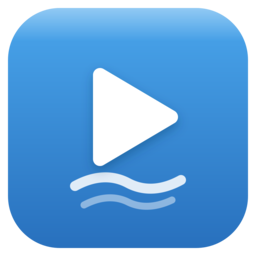

<p align="center">
  
</p>

# FreeFlume

A native desktop YouTube client for Linux, inspired by
[NewPipe](https://github.com/TeamNewPipe/NewPipe) and reimagined for the desktop.

> Built with AI assistance. I made FreeFlume for my own personal use. If you're a
> developer and want to use it, or take parts of it for your own project, you're
> welcome to.

It's a small C++/Qt6 program written from scratch (it shares no code with NewPipe).
It ties together a few existing tools into a fast YouTube client for big screens,
keyboard and mouse:

- **mpv** for playback
- **yt-dlp** for search and extraction
- **Deno** for full-resolution playback

No ads, no account, no telemetry.

## Features

- Search with thumbnails, filters, and channels and playlists in the results
- mpv playback up to 4K with hardware decoding, quality selection, captions, and chapters
- Seek bar with thumbnail previews
- Picture-in-picture, fullscreen, and a mini-player
- SponsorBlock
- Channels with separate Videos and Streams tabs
- Subscriptions with channel feeds, watch history, local playlists, and downloads
- Native look on KDE and other Qt-based desktops, follows your system light/dark theme

## Run the binary

The portable binary ships as `freeflume-<version>-x86_64.tar.gz` on the
[releases page](https://github.com/velkadyneslop/freeflume-linux-qt6/releases).
Extract it and run; it's already executable:

```bash
tar xzf freeflume-*-x86_64.tar.gz
./freeflume
```

It's dynamically linked, so the host needs Qt6, libmpv, and `yt-dlp` (mpv's package
usually provides libmpv):

```bash
# Fedora
sudo dnf install qt6-qtbase-gui mpv yt-dlp
# Arch
sudo pacman -S qt6-base mpv yt-dlp
# Debian / Ubuntu  (on 24.04+ the libqt6* names gain a "t64" suffix)
sudo apt install libqt6widgets6 libqt6openglwidgets6 libqt6network6 \
                 libqt6sql6-sqlite libqt6dbus6 libmpv2 yt-dlp
```

If `yt-dlp` is missing, the app shows a popup with the right command for your distro
on launch.

For full-resolution playback, also install [Deno](https://deno.land):

```bash
curl -fsSL https://deno.land/install.sh | sh      # any distro (Arch: pacman -S deno)
```

YouTube hides its high-resolution streams behind a JavaScript challenge that `yt-dlp`
solves by running the player code in Deno. Without Deno, playback is capped to lower
quality. The app reminds you once if it's missing.

The Flatpak build bundles Qt, libmpv, yt-dlp, and Deno, so there's nothing to install.

## Build

See [doc/BUILD.md](doc/BUILD.md). Quick start on Fedora:

```bash
sudo dnf install gcc-c++ cmake ninja-build qt6-qtbase-devel mpv-devel yt-dlp mpv
cmake -S . -B build -G Ninja && cmake --build build
./build/freeflume
```

`yt-dlp` and `mpv` are runtime requirements.

## License

[GPL-3.0-or-later](LICENSE).
